<picture>
<source media="(max-width: 640px) and (prefers-color-scheme: dark)" srcset="./assets/enclosure/identity-dark-mobile.svg"/>
<source media="(max-width: 640px)" srcset="./assets/enclosure/identity-light-mobile.svg"/>
<source media="(prefers-color-scheme: dark)" srcset="./assets/enclosure/identity-dark.svg"/>
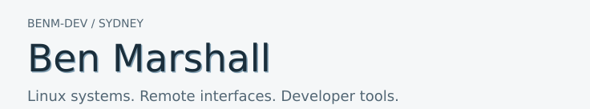
</picture>

<picture>
<source media="(max-width: 640px) and (prefers-color-scheme: dark)" srcset="./assets/enclosure/cover-dark-mobile.svg"/>
<source media="(max-width: 640px)" srcset="./assets/enclosure/cover-light-mobile.svg"/>
<source media="(prefers-color-scheme: dark)" srcset="./assets/enclosure/cover-dark.svg"/>
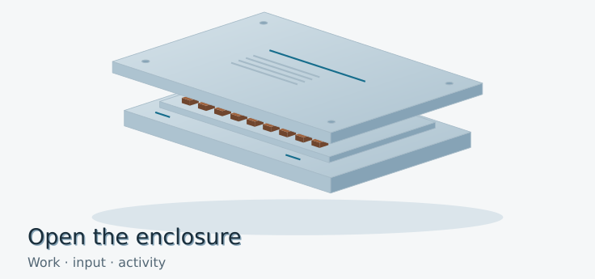
</picture>

<picture>
<source media="(max-width: 640px) and (prefers-color-scheme: dark)" srcset="./assets/enclosure/work-tab-dark-mobile.svg"/>
<source media="(max-width: 640px)" srcset="./assets/enclosure/work-tab-light-mobile.svg"/>
<source media="(prefers-color-scheme: dark)" srcset="./assets/enclosure/work-tab-dark.svg"/>
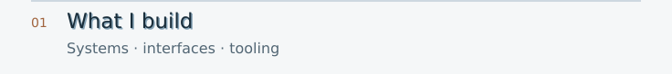
</picture>

<picture>
<source media="(max-width: 640px) and (prefers-color-scheme: dark)" srcset="./assets/enclosure/work-dark-mobile.svg"/>
<source media="(max-width: 640px)" srcset="./assets/enclosure/work-light-mobile.svg"/>
<source media="(prefers-color-scheme: dark)" srcset="./assets/enclosure/work-dark.svg"/>
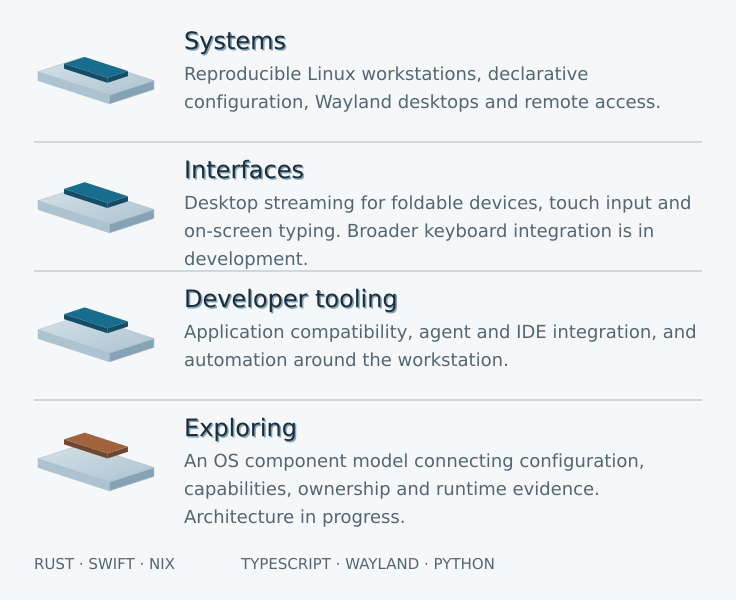
</picture>

<picture>
<source media="(max-width: 640px) and (prefers-color-scheme: dark)" srcset="./assets/enclosure/signal-tab-dark-mobile.svg"/>
<source media="(max-width: 640px)" srcset="./assets/enclosure/signal-tab-light-mobile.svg"/>
<source media="(prefers-color-scheme: dark)" srcset="./assets/enclosure/signal-tab-dark.svg"/>
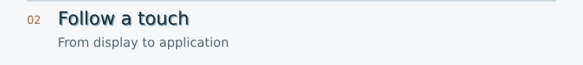
</picture>

<picture>
<source media="(max-width: 640px) and (prefers-color-scheme: dark)" srcset="./assets/enclosure/signal-dark-mobile.svg"/>
<source media="(max-width: 640px)" srcset="./assets/enclosure/signal-light-mobile.svg"/>
<source media="(prefers-color-scheme: dark)" srcset="./assets/enclosure/signal-dark.svg"/>
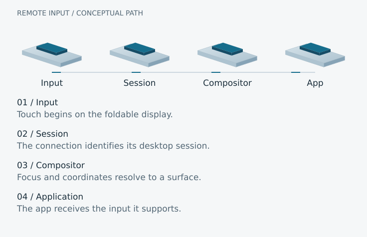
</picture>

<picture>
<source media="(max-width: 640px) and (prefers-color-scheme: dark)" srcset="./assets/enclosure/activity-tab-dark-mobile.svg"/>
<source media="(max-width: 640px)" srcset="./assets/enclosure/activity-tab-light-mobile.svg"/>
<source media="(prefers-color-scheme: dark)" srcset="./assets/enclosure/activity-tab-dark.svg"/>
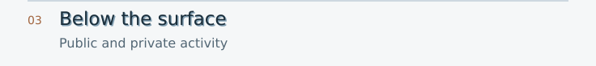
</picture>

<picture>
<source media="(max-width: 640px) and (prefers-color-scheme: dark)" srcset="./assets/enclosure/public-dark-mobile.svg"/>
<source media="(max-width: 640px)" srcset="./assets/enclosure/public-light-mobile.svg"/>
<source media="(prefers-color-scheme: dark)" srcset="./assets/enclosure/public-dark.svg"/>
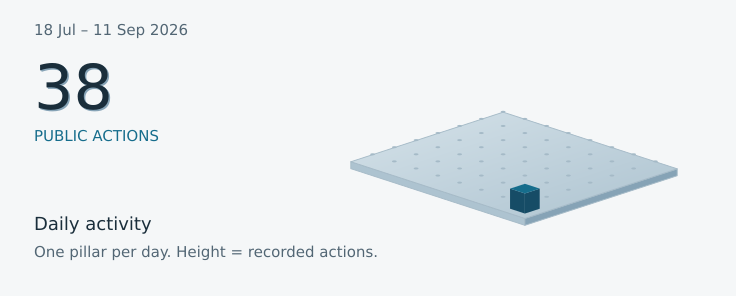
</picture>

<picture>
<source media="(max-width: 640px) and (prefers-color-scheme: dark)" srcset="./assets/enclosure/private-tab-dark-mobile.svg"/>
<source media="(max-width: 640px)" srcset="./assets/enclosure/private-tab-light-mobile.svg"/>
<source media="(prefers-color-scheme: dark)" srcset="./assets/enclosure/private-tab-dark.svg"/>
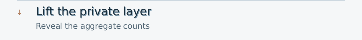
</picture>

<picture>
<source media="(max-width: 640px) and (prefers-color-scheme: dark)" srcset="./assets/enclosure/private-dark-mobile.svg"/>
<source media="(max-width: 640px)" srcset="./assets/enclosure/private-light-mobile.svg"/>
<source media="(prefers-color-scheme: dark)" srcset="./assets/enclosure/private-dark.svg"/>
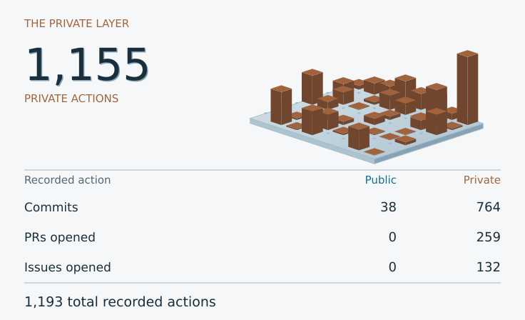
</picture>

<picture>
<source media="(max-width: 640px) and (prefers-color-scheme: dark)" srcset="./assets/enclosure/scope-tab-dark-mobile.svg"/>
<source media="(max-width: 640px)" srcset="./assets/enclosure/scope-tab-light-mobile.svg"/>
<source media="(prefers-color-scheme: dark)" srcset="./assets/enclosure/scope-tab-dark.svg"/>
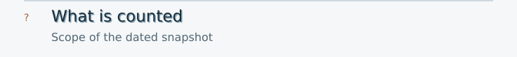
</picture>

<picture>
<source media="(max-width: 640px) and (prefers-color-scheme: dark)" srcset="./assets/enclosure/scope-dark-mobile.svg"/>
<source media="(max-width: 640px)" srcset="./assets/enclosure/scope-light-mobile.svg"/>
<source media="(prefers-color-scheme: dark)" srcset="./assets/enclosure/scope-dark.svg"/>

</picture>

<picture>
<source media="(max-width: 640px) and (prefers-color-scheme: dark)" srcset="./assets/enclosure/footer-dark-mobile.svg"/>
<source media="(max-width: 640px)" srcset="./assets/enclosure/footer-light-mobile.svg"/>
<source media="(prefers-color-scheme: dark)" srcset="./assets/enclosure/footer-dark.svg"/>
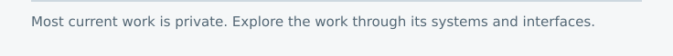
</picture>
