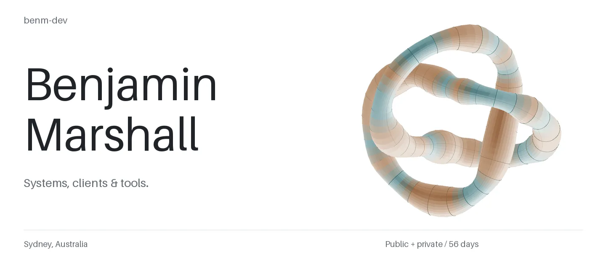
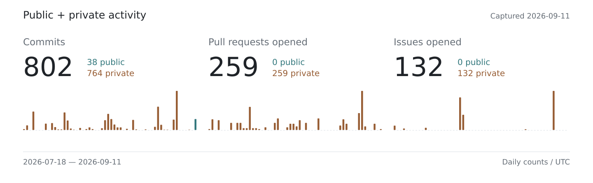

<a href="./DESIGN.md">
  <picture>
    <source media="(prefers-reduced-motion: reduce) and (max-width: 600px) and (prefers-color-scheme: dark)" srcset="./assets/hero-dark-mobile.png" />
    <source media="(prefers-reduced-motion: reduce) and (max-width: 600px)" srcset="./assets/hero-light-mobile.png" />
    <source media="(prefers-reduced-motion: reduce) and (prefers-color-scheme: dark)" srcset="./assets/hero-dark.png" />
    <source media="(prefers-reduced-motion: reduce)" srcset="./assets/hero-light.png" />
    <source media="(max-width: 600px) and (prefers-color-scheme: dark)" srcset="./assets/hero-dark-mobile.webp" />
    <source media="(max-width: 600px)" srcset="./assets/hero-light-mobile.webp" />
    <source media="(prefers-color-scheme: dark)" srcset="./assets/hero-dark.webp" />
    
  </picture>
</a>

[Work](#work) · [Rendering notes](./DESIGN.md) · [Source](./scripts/render_profile.py) · [Site](https://benm-dev.github.io)

I work across Linux systems, remote desktop clients and developer tools. Most of my current work is private.

**Rust · Swift · Nix · TypeScript · Wayland · Python**

## Work

**Systems** — reproducible Linux workstations, declarative configuration, Wayland desktops and remote access.

**Interfaces** — desktop streaming for foldable devices, touch input and on-screen typing. Broader keyboard and desktop integration is in development.

**Developer tooling** — application compatibility, agent and IDE integration, and automation around the workstation.

**Exploring** — an OS component model that connects configuration, capabilities, ownership and runtime evidence. Architecture and design work in progress.

## Activity

<a href="./activity.json">
  <picture>
    <source media="(max-width: 600px) and (prefers-color-scheme: dark)" srcset="./assets/activity-dark-mobile.svg" />
    <source media="(max-width: 600px)" srcset="./assets/activity-light-mobile.svg" />
    <source media="(prefers-color-scheme: dark)" srcset="./assets/activity-dark.svg" />
    
  </picture>
</a>

Daily totals shape the surface; copper increases with the private share. The export contains daily aggregates only.

Commits are deduplicated across accessible owned repositories' default branches. Pull requests and issues count items I opened in the window. These are recorded actions under that scope, not GitHub's contribution-calendar total.

<details>
<summary>How the header works</summary>

Each day controls one section of a 3D trefoil: activity controls its thickness and the public/private split controls its material. Parallel-transport frames, computed surface normals and directional lighting turn that geometry into a seamless WebP loop. The image adapts to screen width, color scheme and reduced-motion preferences through GitHub's native `<picture>` support.

The renderer runs locally from the checked-in snapshot. It needs no external image service or scheduled GitHub workflow.

```bash
python3 -m venv .venv
. .venv/bin/activate
python3 -m pip install -r requirements.txt
python3 scripts/render_profile.py
```

Use `--refresh` with existing local GitHub authentication to collect new public and private counts, or `--still` for static previews. Review and commit the generated assets to update the profile. The [manifest](./assets/manifest.json) records the input hash, geometry parameters and output hashes.

The same mesh also runs live in a truecolor terminal:

```bash
python3 scripts/terminal.py
```

[Rendering notes](./DESIGN.md) · [Renderer](./scripts/render_profile.py) · [Collector](./scripts/collect_activity.py) · [Snapshot](./activity.json)

</details>
